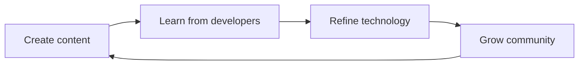

The handbook supports diagrams and animated scenes directly in Markdown. Authors can stay in prose-first `.md` and `.mdx` files without importing React components for every visual.

## Elucim scenes

Use a fenced `elucim` block for diagrams and animated scenes. This should be the default choice for handbook visuals because the result reads better, supports motion, and keeps the diagram source close to the prose.

YAML is the default authoring format because it keeps scenes readable inside chapters. Use `scene.type: player`, a timeline, and a default state machine when the scene should animate.

```elucim
version: "2.0"
scene:
  type: player
  fps: 30
  width: 900
  height: 240
  background: transparent
  children: [contentBox, contentText, techBox, techText, communityBox, communityText, a1, a2, loopLine1, loopLine2, loopLine3, loopText]
elements:
  contentBox:
    id: contentBox
    type: rect
    props: { type: rect, x: 65, y: 72, width: 170, height: 70, rx: 10, fill: "$surface", stroke: "$primary", strokeWidth: 2, opacity: 0 }
  contentText:
    id: contentText
    type: text
    props: { type: text, x: 150, y: 114, content: "create content", fill: "$foreground", fontSize: 16, textAnchor: middle, opacity: 0 }
  techBox:
    id: techBox
    type: rect
    props: { type: rect, x: 365, y: 72, width: 170, height: 70, rx: 10, fill: "$surface", stroke: "$success", strokeWidth: 2, opacity: 0 }
  techText:
    id: techText
    type: text
    props: { type: text, x: 450, y: 114, content: "refine technology", fill: "$foreground", fontSize: 16, textAnchor: middle, opacity: 0 }
  communityBox:
    id: communityBox
    type: rect
    props: { type: rect, x: 665, y: 72, width: 170, height: 70, rx: 10, fill: "$surface", stroke: "$warning", strokeWidth: 2, opacity: 0 }
  communityText:
    id: communityText
    type: text
    props: { type: text, x: 750, y: 114, content: "grow community", fill: "$foreground", fontSize: 16, textAnchor: middle, opacity: 0 }
  a1:
    id: a1
    type: line
    props: { type: line, x1: 235, y1: 107, x2: 365, y2: 107, stroke: "$accent", strokeWidth: 2, endCap: arrow, opacity: 0 }
  a2:
    id: a2
    type: line
    props: { type: line, x1: 535, y1: 107, x2: 665, y2: 107, stroke: "$accent", strokeWidth: 2, endCap: arrow, opacity: 0 }
  loopLine1:
    id: loopLine1
    type: line
    props: { type: line, x1: 750, y1: 142, x2: 750, y2: 202, stroke: "$muted", strokeWidth: 2, opacity: 0 }
  loopLine2:
    id: loopLine2
    type: line
    props: { type: line, x1: 750, y1: 202, x2: 150, y2: 202, stroke: "$muted", strokeWidth: 2, opacity: 0 }
  loopLine3:
    id: loopLine3
    type: line
    props: { type: line, x1: 150, y1: 202, x2: 150, y2: 142, stroke: "$muted", strokeWidth: 2, endCap: arrow, opacity: 0 }
  loopText:
    id: loopText
    type: text
    props: { type: text, x: 450, y: 193, content: "signal keeps the loop moving", fill: "$muted", fontSize: 14, textAnchor: middle, opacity: 0 }
timelines:
  intro:
    id: intro
    duration: 220
    tracks:
      - { target: contentBox, property: opacity, keyframes: [ { frame: 0, value: 0 }, { frame: 12, value: 1, easing: easeOutCubic } ] }
      - { target: contentText, property: opacity, keyframes: [ { frame: 4, value: 0 }, { frame: 16, value: 1, easing: easeOutCubic } ] }
      - { target: a1, property: opacity, keyframes: [ { frame: 32, value: 0 }, { frame: 44, value: 1, easing: easeOutCubic } ] }
      - { target: techBox, property: opacity, keyframes: [ { frame: 50, value: 0 }, { frame: 62, value: 1, easing: easeOutCubic } ] }
      - { target: techText, property: opacity, keyframes: [ { frame: 54, value: 0 }, { frame: 66, value: 1, easing: easeOutCubic } ] }
      - { target: a2, property: opacity, keyframes: [ { frame: 82, value: 0 }, { frame: 94, value: 1, easing: easeOutCubic } ] }
      - { target: communityBox, property: opacity, keyframes: [ { frame: 100, value: 0 }, { frame: 112, value: 1, easing: easeOutCubic } ] }
      - { target: communityText, property: opacity, keyframes: [ { frame: 104, value: 0 }, { frame: 116, value: 1, easing: easeOutCubic } ] }
      - { target: loopLine1, property: opacity, keyframes: [ { frame: 130, value: 0 }, { frame: 142, value: 1, easing: easeOutCubic } ] }
      - { target: loopLine2, property: opacity, keyframes: [ { frame: 138, value: 0 }, { frame: 150, value: 1, easing: easeOutCubic } ] }
      - { target: loopLine3, property: opacity, keyframes: [ { frame: 146, value: 0 }, { frame: 158, value: 1, easing: easeOutCubic } ] }
      - { target: loopText, property: opacity, keyframes: [ { frame: 156, value: 0 }, { frame: 170, value: 1, easing: easeOutCubic } ] }
stateMachines:
  main:
    id: main
    entry: play
    states:
      play: { timeline: intro }
    transitions:
      - { id: entry-play, from: entry, to: play, trigger: onStart }
      - { id: play-loop, from: play, to: entry, exitTime: 1 }
defaultStateMachine: main
```

If the scene YAML is invalid, the page renders a visible error card with the parser message and the original scene source so the author can fix it in place.

## Mermaid diagrams

Use a fenced `mermaid` block only when a simple static chart is enough or when the source needs to stay portable outside the handbook. Prefer Elucim for conceptual diagrams, loops, flows, and anything that benefits from animation.


